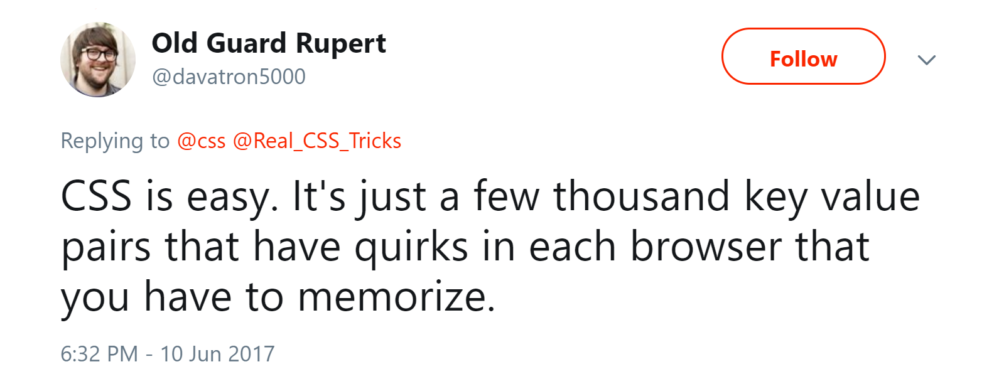

export { default as theme } from "./theme";
import { Head } from "mdx-deck";
import { CodeSurfer } from "mdx-deck-code-surfer";
import WhiteSlide from "./WhiteSlide";

<Head>
  <title>CSS</title>
</Head>

# CSS
### **Cascading** Style Sheets

---

export default WhiteSlide

---

## CSS Metodologier

- Object Oriented CSS
- BEM
- SMACSS

---

## OOCSS

- Separate structure and skin
  - Define repeating visual features as separate “skins”
- Separate container and content
  -  An object should look the same no matter where you put it.

---

<CodeSurfer
  title="OOCSS"
  code={require("raw-loader!./snippets/oocss.css")}
  showNumbers={true}
  lang="css"
  steps={[
    { range: [0, 3] },
    { range: [6, 8] },
    { range: [10, 12]  },
  ]}
/>

---

<CodeSurfer
  title="BEM"
  code={require("raw-loader!./snippets/bem.css")}
  showNumbers={true}
  lang="css"
  steps={[
    { range: [0, 4] },
    { range: [6, 8] },
    { range: [10, 12] },
    { range: [14, 16] },
  ]}
/>

---

[CSS Methodologies](https://codepen.io/hidanielle/post/css-methodologies-naming-conventions-and-file-structures)

---

## Preprocessors

LESS / SCSS / SASS / Stylus

---

<CodeSurfer
  title="Variabler och namespaces"
  code={require("raw-loader!./snippets/namespaces.less")}
  showNumbers={true}
  lang="less"
  steps={[
    { range: [0, 11] },
    { range: [3, 6] },
    { range: [7, 10] },
    { range: [13, 15] },
  ]}
/>

---

<CodeSurfer
  title="Mixins"
  code={require("raw-loader!./snippets/mixins.less")}
  showNumbers={true}
  lang="less"
  steps={[
    { range: [0, 1] },
    { range: [3, 5] },
    { line: 4},
    { range: [8, 11]},
    { range: [10, 10] },
  ]}
/>

---

<CodeSurfer
  title="Maps (3.5.0)"
  code={require("raw-loader!./snippets/maps.less")}
  showNumbers={true}
  lang="less"
  steps={[
    { range: [0, 5] },
    { range: [7, 9] },
  ]}
/>

---

<CodeSurfer
  title="Functions"
  code={require("raw-loader!./snippets/functions.less")}
  showNumbers={true}
  lang="less"
  steps={[
    { range: [0, 3] },
    { range: [5, 10] },
    { range: [12, 15] },
  ]}
/>

---

- [LESS Mixins](https://codepen.io/jesperorb/pen/RvRydy)
- [LESS Loops](https://codepen.io/jesperorb/pen/zeBLLb)
- [LESS Responsive](https://codepen.io/jesperorb/pen/OdRjPg)